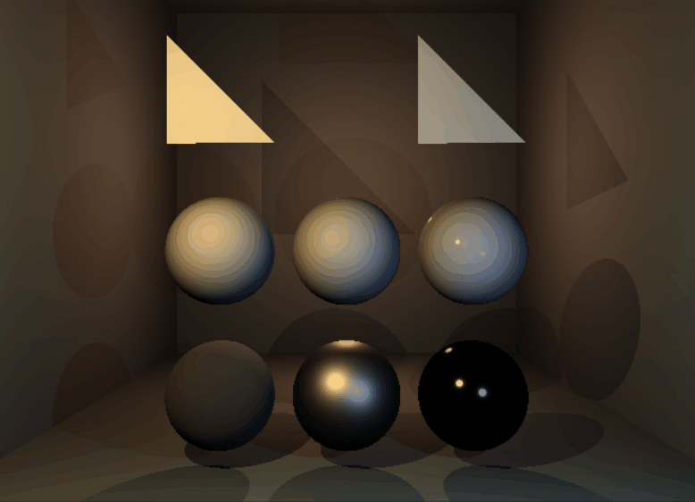
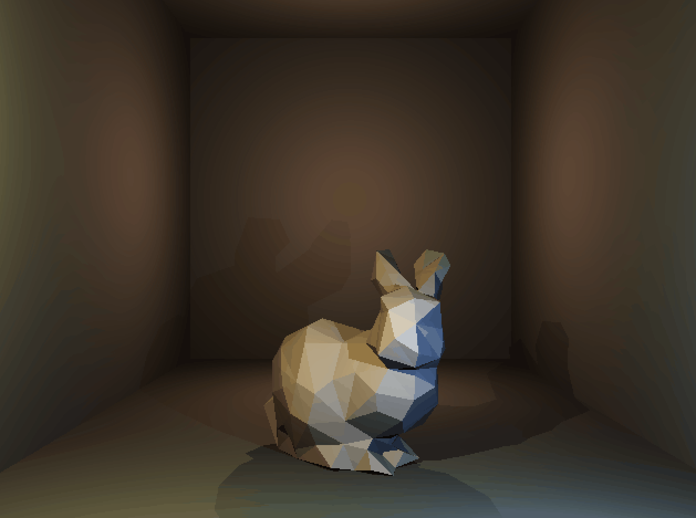

<link href="../../Content/StyleSheet.css" rel="stylesheet"/> 

# [Software Raytracer](https://github.com/DaanDemaecker/RayTracer)

  <md-block>

<a href="../../">Home</a>
- <a href="../../AboutMe/">About Me</a>
- <a href="../../Resume/">Resume</a>

  </md-block>

## Intro
For my Graphics Programming 1 class, we made a CPU raytracer from scratch. 
The performance will never be great as it runs purely on CPU, but it helped us understand core concepts of graphics programming and raytracing. 

## Capabilities
- Rendering primitives:  
  The raytracer can render primitives like triangles and spheres, which comprise most of 3D rendering.
  
  

- Rendering .obj files:  
  The ray tracer can render low-poly .obj file at a decent framerate.
  
  
  
- PBR shading:  
  Materials can give a glossiness, metalness, roughness, etc. and the raytracer  will handle these appropriately.
- BRDF generation:
  To improve performance, the objects are divided into small bounding boxes for easy raytracing checks.

## Conclusion
This was a very challenging project and I wouldn't have been able to do it without help from my teacher and colleagues, but I am very proud of how it ended up.
