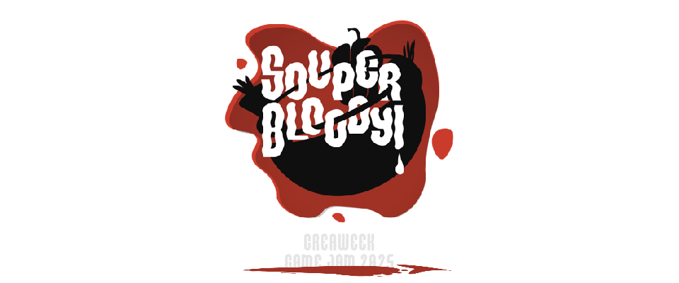

<link href="../../Content/StyleSheet.css" rel="stylesheet"/> 

# <a href="https://simonhuysentruyt.itch.io/souper-bloody target="_blank">Warp Warfare</a>

  <md-block>

<a href="../../">Home</a>
- <a href="../../AboutMe/">About Me</a>
- <a href="../../Resume/">Resume</a>

  </md-block>

## Description
With a team of 3 artists and 3 programmers, we *WON* our school's yearly game jam. It was an amazing experience and taught us a lot about teamwork. The names of my colleagues can be found on our [Itch.io](https://simonhuysentruyt.itch.io/souper-bloody).

## Software
Unity

## Link
<a href="https://simonhuysentruyt.itch.io/souper-bloody" target="_blank">https://simonhuysentruyt.itch.io/souper-bloody</a>
