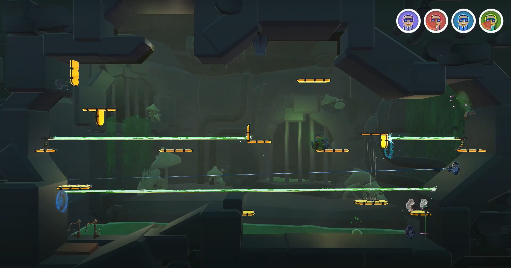

<link href="../Content/StyleSheet.css" rel="stylesheet"/> 

# [Warp Warfare](https://luckyelias.itch.io/group29-warp-warfare)

## | [Projects](https://daandemaecker.github.io)  |    [About me](https://daandemaecker.github.io/AboutMe.html)  |

## Intro
This project was a group project, with 4 artists, 1 sound designer, and me as the **sole** programmer, we made an amazing game and had a lot of fun doing it.  
The names of my colleagues can be found on our [Itch.io](https://luckyelias.itch.io/group29-warp-warfare).

## Goal
We were tasked with making a game where the emphasis was ***FUN*** with the only requirement that it was local multiplayer and made in Unreal Engine 5 or Unity.  
Our game ended up as a free-for-all battle with portal guns as your only weapon, I am proud
of what my team and I accomplished together.  

## Choices and challenges
- Engine choice:  
  The two possible engine choices were Unity and Unreal and because I was the only programmer and I was more used to Unity, that was our choice.
- Gameplay:  
  The gameplay went through multiple ideas, all we knew was that we wanted a free-for-all battle game involving portals. The game ended up as a battle where your only weapon is a portal gun and you kill your opponents using the environment.
- Portals:
  Using portals was my idea because I love the Portal games by Valve and thought it would be a fun challenge to program. I was right on the second part as I had to go through a couple of iterations to get it working the way I wanted it to while still looking good.  
    - First iteration:  
      In the first iteration, I wanted the portals to be as much as the ones from the Portal games. When a player enters a portal, a duplicate player gets made on the other portal, when you go further the player and the duplicate get swapped until you exit the portal.
    - Final product:
      In the final product, the player gets shrunk when entering the portal until too small to be visible, gets teleported to the other portal, and then restored to their former size.  
