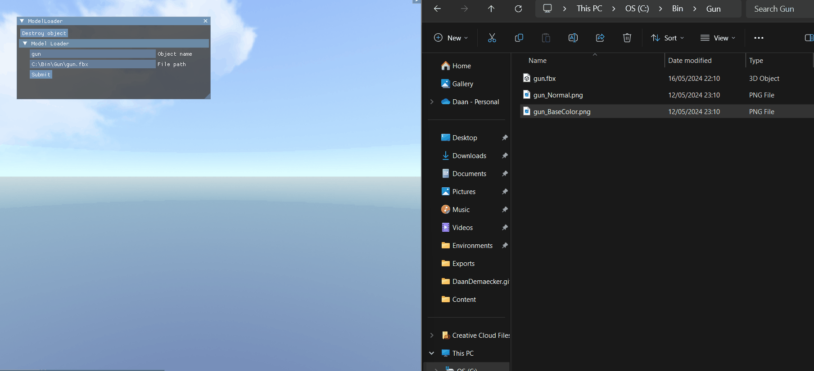

# Daan Demaecker [^1]
## | [Projects](#Projects)  |    [About me](AboutMe.md)  |    [Resume](Content/DaanDemaeckerCV.pdf) |
Hi, my name is [Daan Demaecker](AboutMe.md) and I am a game developer, in this github page, I will tell you a bit more about who I am, what I do, what I did and what I want to do.  

[^1]: Work In Progress

# Projects
## [Warp Warfare](https://luckyelias.itch.io/group29-warp-warfare)
A group project where i was the sole programmer, i had a lot of fun during this project with my coleagues.  
The names of my colleagues can be found on our Itch.io, linked above.

## [Vulkan Renderer](https://github.com/DaanDemaecker/VulkanRenderer)
A renderer that uses the Vulkan Api. 

## [D3D-Lite-Engine](https://github.com/DaanDemaecker/D3D-Lite-Engine)
A small 3D, component-based engine using my VulkanRenderer with object loader as example project.

## [D2D Engine - Bomberman](https://github.com/DaanDemaecker/D2DEngine)
A small 2D, component-based engine with bomberman as test project.  

## [Cuphead remake](https://github.com/DaanDemaecker/CupheadRemake)
A cuphead remake made with a given framework from school.  

## [Software Raytracer](https://github.com/DaanDemaecker/RayTracer)
A purely CPU raytracer.

## [Dual Rasterizer](https://github.com/DaanDemaecker/DualRasterizer)
A rasterizer that can switch between DirectX and purely CPU based.

