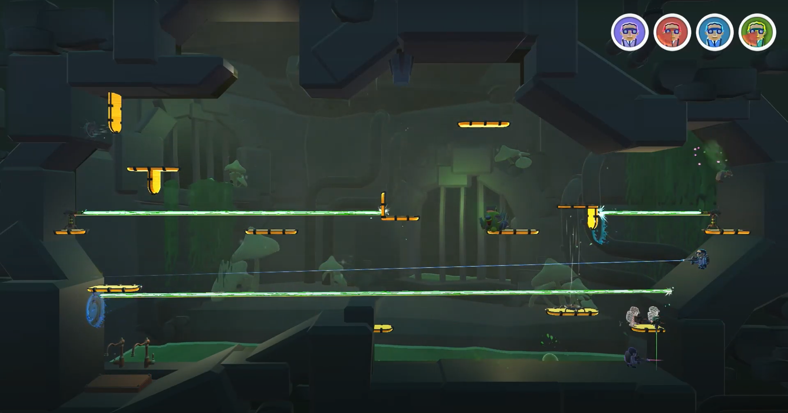

<link href="Content/StyleSheet.css" rel="stylesheet"/> 

# Daan Demaecker | <a href="https://www.linkedin.com/in/daan-demaecker-3737b0265/"> | <a href="https://github.com/DaanDemaecker">

## | [Projects](#Projects)  |    [About me](AboutMe.md)  |    [Resume](Content/DaanDemaeckerCV.pdf) |
Hi, my name is [Daan Demaecker](AboutMe.md), I am a game developer and aspiring Graphics Programmer. This GitHub page will tell you more about who I am, what I do, what I did, and what I want to do.  

# Projects

## Personal projects

|[**VulkanRenderer**](Projects/VulkanRenderer.md)|[**D3D-Lite-Engine**](Projects/D3D-Lite-Engine.md)|
|:----------------------------------------:|:----------------------------------------:|
| Renderer using Vulkan Api | 3D Engine using my renderer |
|<a href="https://daandemaecker.github.io/Projects/VulkanRenderer.html">|<a href="https://daandemaecker.github.io/Projects/D3D-Lite-Engine.html">|

## School projects

|[**Warp Warfare**](Projects/WarpWarfare.md)|[**D2D-Engine**](Projects/D2D-Engine.md)|[**Cuphead Remake**](Projects/CupheadRemake)|
|:----------------------------------------:|:----------------------------------------:|:----------------------------------------:|
| Vertical slice in Unity| Bomberman in custom 2D engine | 2D platformer remake |
|<a href="./Projects/WarpWarfare/">|<a href="https://daandemaecker.github.io/Projects/D2D-Engine.html">|<a href="https://daandemaecker.github.io/Projects/CupheadRemake.html">|
|[**Raytracer**](Projects/SoftwareRayTracer.md)|[**Dual Rasterizer**](Projects/DualRasterizer.md)|[**The Three Guardians**](https://github.com/DaanDemaecker/TheThreeGuardians)|
| CPU raytracer | DirectX and CPU rasterizer | Mechanics based game made with unity |
|<a href="https://daandemaecker.github.io/Projects/SoftwareRayTracer.html">|<a href="https://daandemaecker.github.io/Projects/DualRasterizer.html">| <a href="https://daandemaecker.github.io/Projects/TheThreeGuardians.html">
