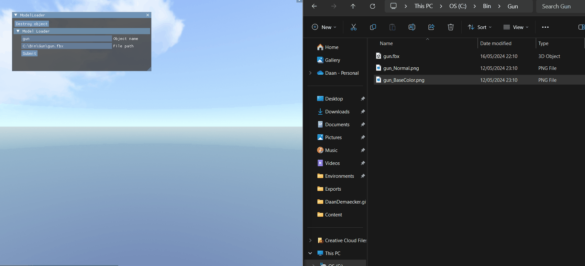
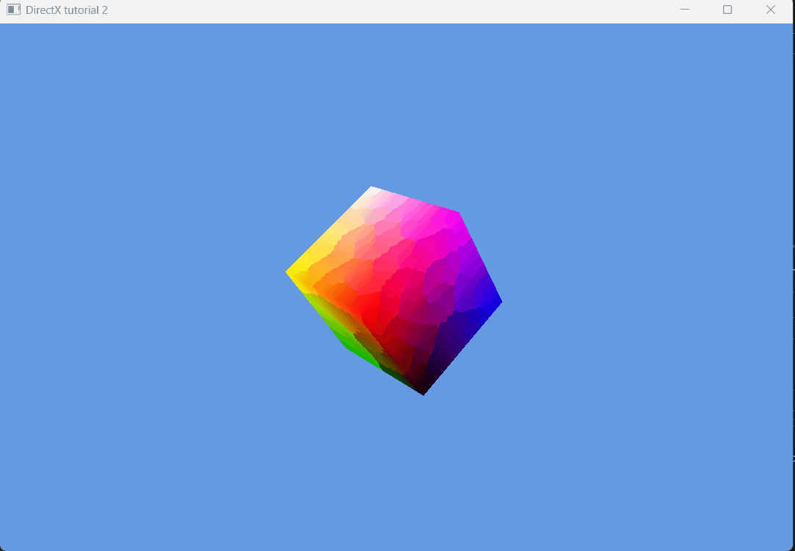
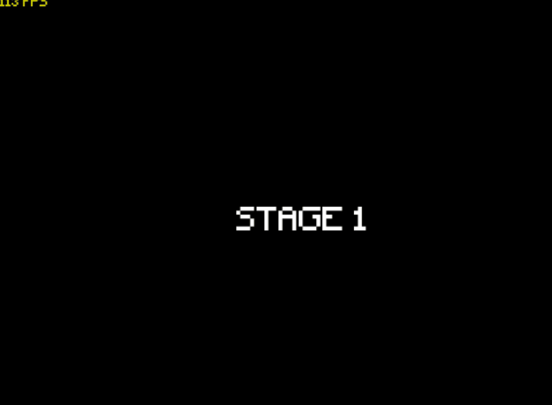
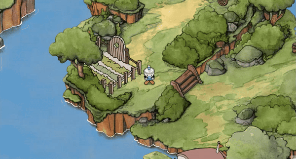

<!DOCTYPE html>
<html>
<head>
  <link href="Content/StyleSheet.css" rel="stylesheet"/>
</head>
<body>

<h1>Daan Demaecker

</h1>

  <h2>
    <a href="#">Home</a>
    - <a href="AboutMe/" class="selected">About Me</a>
    - <a href="Resume/" class="selected">Resume</a>
  </h2>

  Hi, my name is <a href="./AboutMe">Daan Demaecker</a>, I am a game developer and aspiring Graphics Programmer.

<h1>Projects</h2>

<h2>Private projects</h2>

<table style="width:100%">
  <tr>
    <th> <a href="Projects/VulkanRenderer/"><b>VulkanRenderer</b></a></th>
    <th> <a href="Projects/DDM3-Lite-Engine/"><b>DDM3-Lite-Engine</b></a></th>
    <th> <a href="Projects/SouperBloody/"><b>Souper Bloody</b></a></th>
  </tr>

  <tr>
    <th>Renderer using Vulkan API </th>
    <th>3D Engine using my renderer </th>
    <th>Winning Gamejam Game in Unity</th>
  </tr>

  <tr>
    <th></th>
    <th></th>
    <th></th>
  </tr>

  <tr>
    <th><a href="Projects/DirectX12Renderer/"><b>DirectX12 Renderer (WIP)</b></a></th>
  </tr>
  <tr>
    <th><b>Renderer using DirectX12 API</b></th>
  </tr>
  <tr>
    <th></th>
  </tr>
</table>

<h2>School projects</h2>

<table style="width:100%">
  <tr>
    <th> <a href="Projects/WarpWarfare/"><b>Warp Warfare</b></a></th>
    <th> <a href="Projects/D2D-Engine/"><b>D2D-Engine</b></a></th>
    <th> <a href="Projects/CupheadRemake/"><b>Cuphead Remake</b></a></th>
  </tr>

  <tr>
    <th>Vertical slice in unity</th>
    <th>Bomberman remake in custom 2D engine </th>
    <th>2D Platformer remake</th>
  </tr>

  <tr>
    <th></th>
    <th></th>
    <th></th>
  </tr>

  <tr>
    <th><a href="Projects/SoftwareRayTracer/"><b>Software raytracer</b></a></th>
    <th><a href="Projects/DualRasterizer/"><b>Dual rasterizer</b></a></th>
    <th><a href="Projects/TheThreeGuardians/"><b>The three gardians</b></a></th>
  </tr>
  <tr>
    <th><b>CPU Raytracer</b></th>
    <th><b>DirectX and CPU rasterizer</b></th>
    <th><b>Mechanics based game in Unity</b></th>
  </tr>
  <tr>
    <th></th>
    <th></th>
    <th></th>
  </tr>
</table>

</body>
</html>